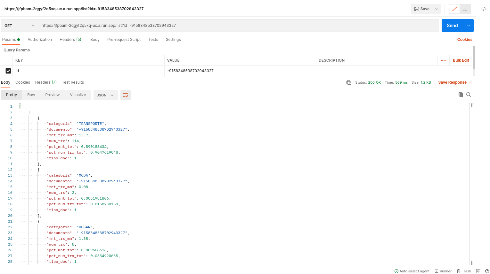
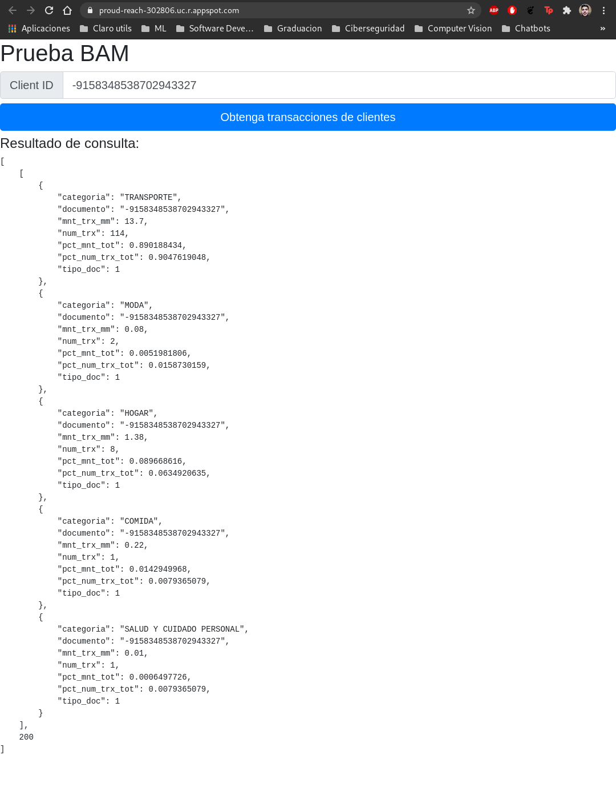

# Prueba Ingeniero de datos
Documentación de ejercicio de prueba para la plaza mencionada, tratare de explicar los pasos realizados para la prueba y las complicaciones que tuve así como las fortalezas y áreas de oportunidad que tengo.  
1. Instale en mi entorno local MongoDB y cree un script "push_data.py" para cargar los datos en forma de documentos utilizando python, se leen los datos utilizando la librería pandas y se convierten a formato json y luego se agregan a la base de datos utilizando la librería pymongo.
2. Se realiza la fase de exploración de datos utilizando python en un ambiente jupyter-notebook, encontré que no hay datos nulos, posteriormente grafique la cantidad de transacciones y montos en millones del conjunto de datos completo y pude observar que la mayor parte de ingresos está clasificada con la categoría OTROS. Mi conclusión en este sentido es que de alguna forma la categoría OTROS está muy generalizada y se debería considerar obtener más información de este tipo de transacciones para poder clasificarla de una mejor manera y/o crear nuevas categorías. También encontré que la mayoría de clientes son locales ya que utilizan su cédula como documento de identificación. La exploración de datos se puede encontrar en el siguiente cuaderno interactivo: [Data_Exploration.ipynb](Data_Exploration.ipynb).
3. Configure un ambiente en la nube de Google Cloud y localmente instale el SDK para poder utilizar google-cloud shell desde mi PC.
4. Escribí un script en python para subir los datos al ambiente local y a la nube, se utilizo la base de datos **Firestore** proporcionada por *google-cloud* y se utiliza la *API* de python para facilitar la interacción. Ver código del script en el siguiente enlace: [push_data.py](push_data.py).
5. Realice un *API* utilizando la librería **Flask** de python, se configuro el endpoint **https://api_url/list** el cual se maneja con la petición HTTP GET y dentro de la petición se espera recibir el parametro **id** que corresponde al documento de identificación del cliente. Como resultado devuelve un objeto json con la información de todas las transacciones de un cliente, a continuación un ejemplo del uso de la API desde *Postman* enviando parametros por la URL:  La URL de la *API* es: [https://jfpbam-2qgyf2q5xq-uc.a.run.app/list](https://jfpbam-2qgyf2q5xq-uc.a.run.app/list).  
El despliegue fue sencillo utilizando *cloud function* de google-cloud donde se genera la descripción de un contenedor de docker y utilizando el *SDK* de google-cloud se publica y genera la URL para acceder a la *API*.
6. Para generar el frontend se utilizó HTML, CSS (Bootstrap) y Javascript, se hosteo en el *App engine* de google-cloud para subirlo se utilizo el *SDK*. Tuve complicaciones al consumir la API ya que para utilizar desde javascript se debía activar la funcionalidad de *Cross-Origin* para poder tener acceso a métodos de *APIs* de un dominio en internet; investigue bastante de este tema y lo pude solucionar utilizando la librería **Flask_cors** del lado del servidor. A continuación se muestra un ejemplo del frontend solicitando los datos de un cliente: 
El *frontend* se encuentra alojado en la siguiente URL: [https://proud-reach-302806.uc.r.appspot.com/](https://proud-reach-302806.uc.r.appspot.com/)  
Para realizar las pruebas se puede utilizar los ids: -9158348538702943327, -8991408786111259824, invalid. El código empleado en el sitio se puede observar en: [index.html](webapp/www/index.html), se utilizo la tecnología *ajax* para realizar la petición *GET*.

A nivel personal esta prueba me hizo aprender temas en los que no tengo experiencia, por ejemplo utilizar el *SDK* y hostear *APIs* y sitios web en google-cloud de forma sencilla. Para la realización de esta prueba tuve que leer bastante documentación de este servicio cloud.  
Aparte de eso en la implementación del *API* aprendí la importancia del *Cross-origin* para poder consumir en un dominio distinto.
